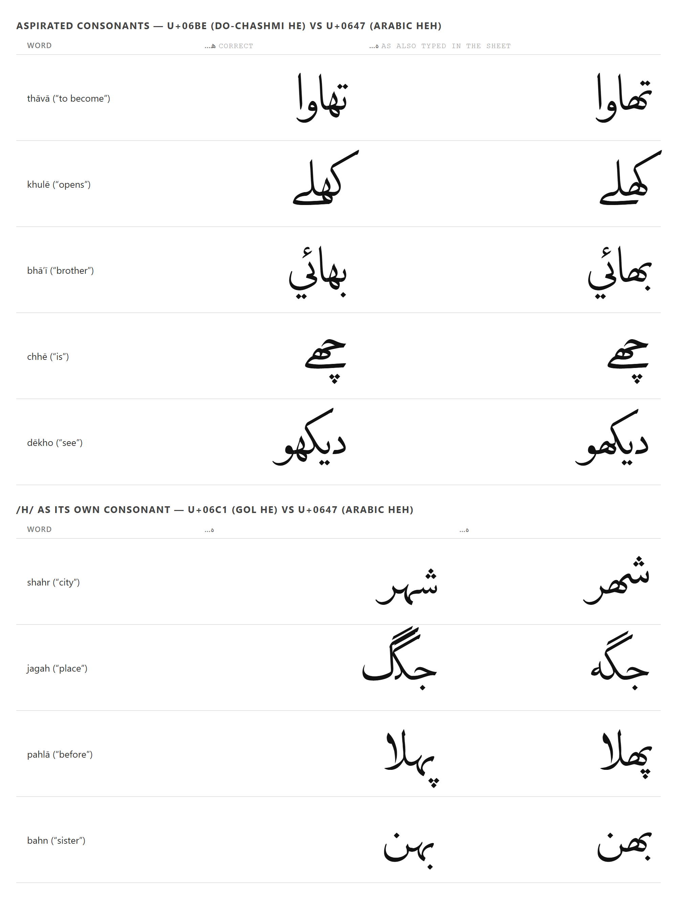
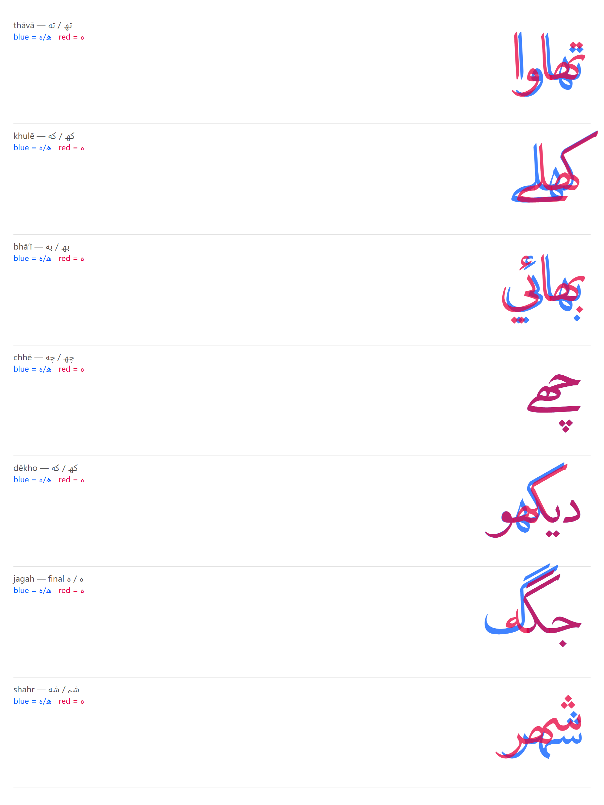

# The three he's: digraph spelling in the LSD wordlist

**Status: findings only.** Nothing in the wordlist, the generator or the font has been
changed by this document. Everything below was produced by reading
`RMS_Mumineen_LSD_wordlist_v4.xlsx`, `src/i18n/lsd.json` and `public/fonts/kanz-al-lulu.woff2`.

---

## Summary

Lisan ud-Dawat needs three different he characters and the wordlist uses all three for the
same sounds, interchangeably:

| char | codepoint | name | what it is for | uses in the sheet |
|---|---|---|---|---|
| ھ | U+06BE | heh doachashmee ("two-eyed he") | the **second half of an aspirated digraph** — تھ، کھ، بھ، چھ، گھ | 408 |
| ہ | U+06C1 | heh goal ("round he") | /h/ as **its own consonant** — شہر، جگہ، پہلا | 186 |
| ه | U+0647 | arabic heh | /h/ in **Arabic loanwords** — الله، رشته، توجه | 538 |

Three findings, in descending order of how much they matter:

1. **The sheet spells the same word two different ways** — 13 words, 385 word-instances,
   293 of 1189 rows. `شہر` and `شهر` both mean "city" and both ship.
2. **Word-final ہ (U+06C1) renders wrong in Kanz al-Lulu** — the font has no `fina` glyph
   for it. This affects one word, `جگہ` ("place"), on 17 rows.
3. **254 rows carry a legacy-encoding corruption** that replaces every Urdu-specific letter
   with a doubled Arabic one — including a *third* spelling of the he. `شظظر` is also "city".

The generator is not implicated in any of this. See "The generator is clean" below.

---

## 1. The sheet spells the same word two ways

Grouping every he-bearing word by its skeleton (he characters masked out) and looking for
skeletons with more than one spelling:

| spelling A | spelling B |
|---|---|
| شہر ×86 | شهر ×73 |
| نتهي ×43 | نتھي ×1 |
| تھئي ×28 | تهئي ×15 |
| الشہر ×30 | الشهر ×1 |
| ھ ×20 | ه ×1 |
| كه ×17 | كھ ×2 |
| تھيو ×15 | تهيو ×4 |
| تهاوا ×16 | تھاوا ×2 |
| شہرو ×10 | شهرو ×1 |
| بهائي ×6 | بھائي ×4 |
| نه ×4 | نھ ×1 |
| تهاسسس ×2 | تھاسسس ×1 |
| وسہلا ×1 | وسهلا ×1 |

**13 skeletons · 385 word-instances · 293 sheet rows.**

Note the shape of the split. `شہر`/`شهر` is close to an even 86/73 — two authors, or two
authoring sessions, with different keyboards. The rest are lopsided (43/1, 30/1, 17/2),
which reads as a dominant habit plus occasional slips.

Of 167 distinct he-bearing words: 102 use ه, 58 use ھ, 9 use ہ.

### Why it matters even where it looks fine

Two strings that differ by one codepoint are two different strings to everything that is not
a human eye:

- `normKey`/`bakedValue` in `src/i18n/wordlistNorm.mjs` normalise whitespace and ornaments
  but **do not** touch letters, by design. So the override-retirement check and
  `api/sync-wordlist.ts`'s row matching both compare he-for-he.
- Any future search, dedup or coverage tooling over the LSD side inherits the same split.
- The font happens to paper over some of it (§2) — but only this font, only in some contexts.

## 2. What Kanz al-Lulu actually does with each he

`public/fonts/kanz-al-lulu.woff2` and `KanzalLulu-Regular (1).ttf` are the same font
(md5 `3de73b431efe6f27d91fda26b0204aa0`) — 1472 glyphs, 655 mapped codepoints.

All three he's are in the cmap. The difference is in GSUB:

| char | `init` | `medi` | `fina` |
|---|---|---|---|
| ه U+0647 | ✅ FEEB | ✅ FEEC | ✅ FEEA |
| ھ U+06BE | ✅ FBAC | ✅ FBAD | ✅ FBAB |
| ہ U+06C1 | ✅ FBA8 | ✅ FBA9 | ❌ **absent** |

The final-form glyphs `uniFBA6` and `uniFBA7` are not in the font at all.

The font is clearly *built* for the ھ digraph: it carries roughly 70 dedicated glyphs keyed
on U+06BE — `uni062A06BE.liga.init.medi` (te+he), `uni064306BE.liga.init.fina` (kaf+he),
`uni06AF06BE.init` (gaf+he), and three-way forms with barree ye such as
`uni062A06BE06D2.liga.init.medi.fina`. U+0647 has its own large ligature set, but an
Arabic one — الله, heh+meem, heh+yeh.

### Measured: are the two spellings distinguishable on screen?

Rendered in Chromium at 120px and compared pixel-for-pixel. Each consonant, digraph in
isolation, `C+ھ` against `C+ه`:

```
beh 93%   teh 95%   theh 75%   jeem 72%   hah 58%   khah 55%   dal 42%
reh 41%   seen 82%  sheen 63%  kaf 62%    lam 74%   meem 82%   noon 89%
yeh 95%   peh 76%   tteh 88%   cheh 49%   ddal 41%  rreh 39%   gaf 84%
                                      (% of ink differing — 21/21 differ)
```

So in isolation the two are always different glyphs. **But inside a word the font sometimes
collapses them.** Testing whole words, `چھے` vs `چهے` and `گھڑي` vs `گهڑي` come out
*pixel-identical* — the three-way ligature with the following letter absorbs the distinction.

The practical read: the ه/ھ mix-up is **usually visible but sometimes not**, depending on what
follows. That is the worst case for proofreading, because a reviewer who checks a few words
and finds them fine has learned nothing about the rest.



The overlay below is the same data with the two spellings superimposed — blue is ھ/ہ, red is
ه. Where you see only red, the two are identical; where blue and red separate, they are not.



### The one that is plainly broken: word-final ہ

With no `fina` glyph, a word-final U+06C1 does not get its joining form. `جگہ` renders with
the he replaced by a stray swash off the گ — the letter is effectively lost. `جگه` (U+0647)
renders correctly.

Only one word in the sheet is affected: **`جگہ` ×17**, on rows
67, 94, 111, 249, 252, 265, 305, 312, 317, 341, 374, 594 and five more.

Everywhere else ہ happens to fall word-medially (شہر، پہلا، بہن، چہلم), where `medi` exists
and it renders.

## 3. Adjacent: 254 rows carry a legacy-encoding corruption

Not the brief, but it lands on the same characters and anyone fixing the he's will hit it.

254 of 1189 rows contain runs of doubled Arabic letters. They are not typos — each doubled
letter systematically stands in for one Urdu-specific letter:

| in the sheet | should be | evidence |
|---|---|---|
| ظظ | ہ | `شظظر` → `شہر` (×86 clean elsewhere), `مظظمان` → `مہمان` |
| ثث | پ | `ثثورو` → `پورو` (×8), `ثثو` → `پو` (×12) |
| سس | ے | `واسطسس` → `واسطے` (×46), `نسس` → `نے` (×71) |
| كك | گ | `سككلا` → `سگلا` (×29), `ككيو` → `گيو` (×7) |
| حح | چ | `ححنو` → `چنو` (×30) |
| ضض | ٹ | `هضضاوو` → `هٹاوو` |
| طط | ں | `نهيطط` → `نهيں`, `وهاطط` → `وهاں` |

The test: substitute and check whether the result exists as a real word elsewhere in the same
sheet. 19 of 82 distinct corrupt words resolve to an exact clean twin; the remaining 63 resolve
to plainly correct LSD that simply never appears in clean form (`سكائے`, `ميں`, `مہمان`,
`چكا`, `خدمةگزار`, `پچهي`).

This is the signature of text authored in a legacy non-Unicode Urdu font and re-read as
Unicode Arabic. It means **"city" currently ships three ways**: `شہر`, `شهر`, `شظظر`.

Rows: `ثث` 163 · `ضض` 32 · `كك` 32 · `ظظ` 17 · `حح` 13 · `طط` 12 · `سسس` 10.

## The generator is clean

`scripts/build-lsd-dict.mjs` does not rewrite letters. Checked directly: of 1183 non-empty
rows, **1178 reach `lsd.json` byte-for-byte** (modulo the RLM prefix `bakedValue` adds to
mixed-script values, which is a formatting character and alters no letter).

The 5 that don't are rows 76, 81, 89, 92, 94 — each has a later duplicate row carrying the
`remove` sentinel, so last-write-wins blanks them. Deliberate, documented, not corruption.

Character counts confirm it: sheet 538/408/186 (ه/ھ/ہ) → json 535/400/184, and the whole
delta is those five blanked rows.

**So every finding above is a property of the spreadsheet, not of the build.**

## What a fix would have to decide

Not doing this here — it edits the wordlist and the generator, both of which belong to another
session. Recording the open questions while the evidence is fresh:

1. **Is a normalisation pass wanted at all, or should the sheet be corrected at source?**
   Normalising in `bakedValue` would fix rendering everywhere at once but would make the sheet
   and the app disagree, and `api/sync-wordlist.ts` matches overrides back to sheet rows —
   normalising one side without the other reintroduces exactly the drift
   `docs/assertion-discipline.md` warns about.
2. **ه → ھ cannot be blanket-applied.** Genuine Arabic loanwords (`الله`, `رشته`, `توجه`,
   `دوباره`, `سكينه`, place names `جده`، `دوحه`، `كلكته`، `برطانيه`) correctly take U+0647.
   A rule keyed on "consonant + he where the he is not word-final" would still catch `رشته`
   wrongly. This needs the wordlist owner, not a regex.
3. **`جگہ` word-final ہ needs a decision independent of the rest**: correct the data to
   U+0647, or fix the font by adding a `fina` mapping. The data change is cheap and reversible;
   the font change is correct but means re-running `scripts/build-fonts.mjs`.
4. **The ظظ-class corruption is a separate, larger job** and should probably be re-exported
   from the original source rather than patched character by character.

## Reproducing this

Everything here came from four read-only probes: a codepoint census over the sheet and
`lsd.json`; a TTF `cmap`/`GSUB`/`post` parse; a Chromium render of each spelling pair with
pixel comparison; and a substitution test for §3. No repo file was modified to produce it.

Two measurement traps worth recording, because both produced confident wrong answers first:

- **Centred text.** Diffing two spellings rendered centred reports ~100% difference for
  everything, because a few pixels of advance-width change shifts the whole word. Right-aligning
  to the RTL start edge does not fix it either — a mid-word he still shifts everything after it.
- **Whole-word diffing.** A single global x-offset cannot cancel a mid-word difference, so
  every pair looks "different" regardless. Only comparing the digraph *in isolation*, with
  nothing following it, actually answers the question.

The glyph tables alone would also have misled: they show ه and ھ mapping to different glyphs,
which suggests the mix-up is always visible. Rendering shows it is not.
